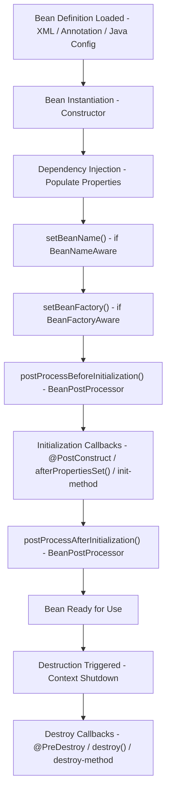
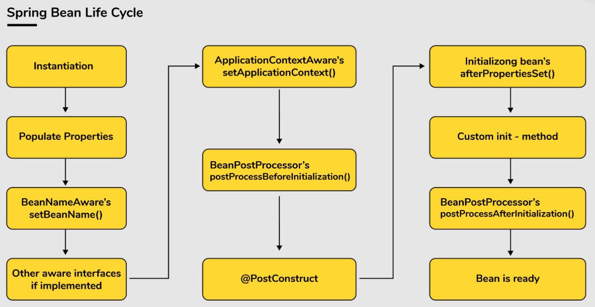

### Spring Bean.
[//]: # (What is Spring Bean?)
<div class="quiz-box">
<b>What is Spring Bean?</b>
<details class="quiz-toggle">
<summary>Reveal Answer</summary>
A Spring Bean is an object managed by the <b>Spring IoC (Inversion of Control)</b> container. In the Spring Framework, beans are the backbone of your application, and they are created, configured, and assembled by the container. <br> 
It is defined in a configuration file (XML, Java-based annotations, or Java Config) or discovered through component scanning.    
A bean's lifecycle involves creation, initialization, use, and destruction, all managed by the Spring container.<br>
There are 2 ways to create Beans - @Component and @Bean.
The IoC container instantiates the bean from the bean’s definition in the XML file.
Spring then populates all of the properties using the dependency injection as specified in the bean definition.
The bean factory container calls setBeanName() which take the bean ID and the corresponding bean has to implement BeanNameAware interface.
The factory then calls setBeanFactory() by passing an instance of itself (if BeanFactoryAware interface is implemented in the bean).
If BeanPostProcessors is associated with a bean, then the preProcessBeforeInitialization() methods are invoked.
If an init-method is specified, then it will be called.
Lastly, postProcessAfterInitialization() methods will be called if there are any BeanPostProcessors associated with the bean that needs to be run post creation.



<b>  Bean Lifecycle Code Example - </b>

```java
import org.springframework.beans.*;
import org.springframework.beans.factory.*;
import org.springframework.context.annotation.*;
import javax.annotation.*;

// Step 1: Create a Bean implementing lifecycle interfaces
@Component
public class MyBean implements BeanNameAware, BeanFactoryAware, InitializingBean, DisposableBean {

    private String beanName;

    public MyBean() {
        System.out.println("1. Constructor: Bean is instantiated");
    }

    // Called after properties are set via DI
    @Autowired
    public void setDependency(SomeDependency dep) {
        System.out.println("2. Setter Injection: Dependencies are injected");
    }

    // BeanNameAware interface method
    @Override
    public void setBeanName(String name) {
        this.beanName = name;
        System.out.println("3. setBeanName(): Bean name is '" + name + "'");
    }

    // BeanFactoryAware interface method
    @Override
    public void setBeanFactory(BeanFactory factory) throws BeansException {
        System.out.println("4. setBeanFactory(): BeanFactory is set");
    }

    // Called by BeanPostProcessor BEFORE initialization
    // (Handled by CustomBeanPostProcessor below)

    // @PostConstruct annotation method
    @PostConstruct
    public void postConstruct() {
        System.out.println("6. @PostConstruct: Post-construct method called");
    }

    // InitializingBean interface method
    @Override
    public void afterPropertiesSet() {
        System.out.println("7. afterPropertiesSet(): InitializingBean method called");
    }

    // Custom init method (if specified in @Bean)
    public void customInit() {
        System.out.println("8. customInit(): Custom init-method called");
    }

    // Called by BeanPostProcessor AFTER initialization
    // (Handled by CustomBeanPostProcessor below)

    // @PreDestroy annotation method
    @PreDestroy
    public void preDestroy() {
        System.out.println("10. @PreDestroy: Pre-destroy method called");
    }

    // DisposableBean interface method
    @Override
    public void destroy() {
        System.out.println("11. destroy(): DisposableBean method called");
    }

    // Custom destroy method (if specified in @Bean)
    public void customDestroy() {
        System.out.println("12. customDestroy(): Custom destroy-method called");
    }
}

// Step 2: BeanPostProcessor for pre/post initialization hooks
@Component
public class CustomBeanPostProcessor implements BeanPostProcessor {

    @Override
    public Object postProcessBeforeInitialization(Object bean, String beanName) {
        if (bean instanceof MyBean) {
            System.out.println("5. postProcessBeforeInitialization(): Before init");
        }
        return bean;
    }

    @Override
    public Object postProcessAfterInitialization(Object bean, String beanName) {
        if (bean instanceof MyBean) {
            System.out.println("9. postProcessAfterInitialization(): After init");
        }
        return bean;
    }
}

// Step 3: Configuration class
@Configuration
@ComponentScan
public class AppConfig {

    @Bean(initMethod = "customInit", destroyMethod = "customDestroy")
    public MyBean myBean() {
        return new MyBean();
    }
}
```

**Output (in order):**
```
1. Constructor: Bean is instantiated
2. Setter Injection: Dependencies are injected
3. setBeanName(): Bean name is 'myBean'
4. setBeanFactory(): BeanFactory is set
5. postProcessBeforeInitialization(): Before init
6. @PostConstruct: Post-construct method called
7. afterPropertiesSet(): InitializingBean method called
8. customInit(): Custom init-method called
9. postProcessAfterInitialization(): After init
--- Application Running ---
10. @PreDestroy: Pre-destroy method called
11. destroy(): DisposableBean method called
12. customDestroy(): Custom destroy-method called
```

<b>Lifecycle Order Summary - </b>

<table style="width:100%">
    <thead>
        <tr>
            <th>Method</th>
            <th>Interface/Annotation</th>
        </tr>
    </thead>
    <tbody>
        <tr>
            <td>Constructor</td>
            <td>-</td>
        </tr>
        <tr>
            <td>Setter/Field Injection</td>
            <td>@Autowired</td>
        </tr>
        <tr>
            <td>setBeanName()</td>
            <td>BeanNameAware</td>
        </tr>
        <tr>
            <td>setBeanFactory()</td>
            <td>BeanFactoryAware</td>
        </tr>
        <tr>
            <td>postProcessBeforeInitialization()</td>
            <td>BeanPostProcessor</td>
        </tr>
        <tr>
            <td>@PostConstruct</td>
            <td>javax.annotation</td>
        </tr>
        <tr>
            <td>afterPropertiesSet()</td>
            <td>InitializingBean</td>
        </tr>
        <tr>
            <td>init-method</td>
            <td>@Bean(initMethod)</td>
        </tr>
        <tr>
            <td>postProcessAfterInitialization()</td>
            <td>BeanPostProcessor</td>
        </tr>
        <tr>
            <td>@PreDestroy</td>
            <td>javax.annotation</td>
        </tr>
        <tr>
            <td>destroy()</td>
            <td>DisposableBean</td>
        </tr>
        <tr>
            <td>destroy-method</td>
            <td>@Bean(destroyMethod)</td>
        </tr>
    </tbody>
</table>
<br><br>


</details>
</div>

[//]: # (What is Bean Scope?)
<div class="quiz-box">
<b>What is Bean Scope?</b>
<details class="quiz-toggle">
<summary>Reveal Answer</summary>
There are different bean scope that determines how and when they are created.<br>
<b>Singleton (default)</b> - There will be a single instance of the bean is created for the entire Spring container.<br>Default scope. Only one instance created per IOC. Singleton are eagerly initialized by IOC ( means at the time of application startup, object gets created ).<br>
<b>Prototype</b> - A new instance is created every time the bean is created. It is lazily initialized.<br>
<b>Request</b>	- A new instance is created for each HTTP request (web applications).<br>
<b>Session</b>	- A new instance is created for each HTTP session (web applications). When user access any endpoint the session is created. Remains active till it does not expires.<br>
<b>Global Session</b> - Scoped to a global HTTP session (portlet applications).<br><br>
Beans are cerated vis XML configuration files. Configuration like `@Configuration` and `@Bean`. Annotation-based configuration like `@Component`, `@Service`, `@Repository`, and `@Controller`.


```java
// Every injection returns the same instance.
@Component
@Scope("singleton")
public class SingletonBean {
    public SingletonBean() {
        System.out.println("SingletonBean instance created");
    }
}
// Each injection or context.getBean() call creates a fresh object.
@Component
@Scope("prototype")
public class PrototypeBean {
    public PrototypeBean() {
        System.out.println("PrototypeBean instance created");
    }
}
// Different instance for each incoming HTTP request.
@Component
@Scope(value = WebApplicationContext.SCOPE_REQUEST, proxyMode = ScopedProxyMode.TARGET_CLASS)
public class RequestBean {
    public RequestBean() {
        System.out.println("RequestBean instance created per request");
    }
}
// Same bean reused across requests in the same session
@Component
@Scope(value = WebApplicationContext.SCOPE_SESSION, proxyMode = ScopedProxyMode.TARGET_CLASS)
public class SessionBean {
    public SessionBean() {
        System.out.println("SessionBean instance created per session");
    }
}
// Rarely used — specific to portlet-based apps.
@Component
@Scope(value = WebApplicationContext.SCOPE_GLOBAL_SESSION, proxyMode = ScopedProxyMode.TARGET_CLASS)
public class GlobalSessionBean {
    public GlobalSessionBean() {
        System.out.println("GlobalSessionBean instance created per global session");
    }
}

public class ScopeDemo {
    public static void main(String[] args) {
        AnnotationConfigApplicationContext context = new AnnotationConfigApplicationContext(AppConfig.class);

        System.out.println("Testing Singleton Scope:");
        MyBean singleton1 = context.getBean("singletonBean", MyBean.class);
        MyBean singleton2 = context.getBean("singletonBean", MyBean.class);
        System.out.println("Are singleton beans same? " + (singleton1 == singleton2));

        System.out.println("\nTesting Prototype Scope:");
        MyBean prototype1 = context.getBean("prototypeBean", MyBean.class);
        MyBean prototype2 = context.getBean("prototypeBean", MyBean.class);
        System.out.println("Are prototype beans same? " + (prototype1 == prototype2));

        context.close();
    }
}
/*
The output.

SingletonBean instance created
PrototypeBean instance created

Testing Singleton Scope:
Are singleton beans same? true

Testing Prototype Scope:
PrototypeBean instance created
PrototypeBean instance created
Are prototype beans same? false
*/


```
The Spring Bean configuration file is the XML file. It is the fundamental to how the Spring Framework operates because it provides metadata about the application’s beans and their relationships. This file serves as the blueprint for the IoC (Inversion of Control) Container, allowing Spring to manage bean creation, wiring, and lifecycle effectively.<br><br

<b>Inner Bean</b> - An inner bean in Spring is a bean defined inside another bean’s configuration, typically in XML, and it exists only within the scope of its enclosing bean. It’s used when a dependency is tightly coupled and not meant to be shared across the container.   <br>

An <b>inner bean</b> is a bean declared within the <property> or <constructor-arg> of another bean in XML configuration. It is created every time the outer bean is created. It cannot be accessed independently by the container. <br>
It is used when the dependency is private to a single bean and should not be reused elsewhere. Inner beans are anonymous — they don’t have an id or name and cannot be injected into other beans.

```xml
<bean id="outerBean" class="com.example.OuterBean">
    <property name="dependency">
        <bean class="com.example.InnerDependency">
            <property name="value" value="Injected via inner bean"/>
        </bean>
    </property>
</bean>
<!-- InnerDependency is an inner bean. It is created with outerBean and has no global bean id. -->
```

<b>Bean Initialization - </b>

<table style="width:100%">
    <thead>
        <tr>
            <th>Type</th>
            <th>When Created</th>
            <th>Scopes</th>
            <th>Why</th>
        </tr>
    </thead>
    <tbody>
        <tr>
            <td><b>Eager</b></td>
            <td>At application startup</td>
            <td>Singleton (default)</td>
            <td>Fail-fast — wiring errors surface at boot, not in production</td>
        </tr>
        <tr>
            <td><b>Lazy</b></td>
            <td>On first actual use</td>
            <td>Prototype, Request, Session</td>
            <td>Saves memory/time for beans that may never be used</td>
        </tr>
    </tbody>
</table>

<br>
<b>Why Eager?</b><br>
Singleton beans are created eagerly because Spring wants to <b>validate the entire application context at startup</b>.<br>
If a dependency is missing, a circular reference exists, or a config is wrong — you find out <b>immediately when the app boots</b>, not when a user hits an endpoint at 2 AM in production.<br>
This is the <b>fail-fast principle</b> — catch problems early, not late.<br><br>

<b>Eager (Singleton)</b> — Spring pre-creates all singleton beans at startup. Fails fast if wiring is broken.
<b>Lazy (Prototype etc.)</b> — Bean is created only when `getBean()` is called or it is injected. A new instance every time.
You can force any bean to be lazy using `@Lazy` on a singleton.

```java
@Component
@Lazy // Created only when first injected, not at startup
public class HeavyReportService { }
```
> Use `@Lazy` sparingly — it trades startup safety for deferred load time.
</details>
</div>

[//]: # (What is Bean Factory?)
<div class="quiz-box">
<b>What is Bean Factory?</b>
<details class="quiz-toggle">
<summary>Reveal Answer</summary>
A BeanFactory in Spring is the root interface for accessing the Spring IoC container. It defines the fundamental contract for managing beans — instantiation, wiring, and lifecycle. It is the simplest container that provides basic dependency injection. The key point is that BeanFactory <b>lazily initializes</b> beans - It creates them only when you explicitly request them via getBean(). This makes it lightweight but less feature‑rich compared to ApplicationContext, which eagerly initializes singletons and adds enterprise features like event propagation, internationalization, and annotation scanning. In practice, we rarely use BeanFactory directly in modern applications — ApplicationContext is the standard.

```java
public class BeanFactoryDemo {
    public static void main(String[] args) {
        Resource resource = new ClassPathResource("beans.xml");
        BeanFactory factory = new XmlBeanFactory(resource);

        MyService service = (MyService) factory.getBean("myService");
        service.performTask();
    }
}
```
BeanFactory is conceptual — it shows how Spring achieves IoC at its core.
</details>
</div>

[//]: # (How spring boot finds the bean.)
<div class="quiz-box">
<b>How spring boot finds the bean.</b>
<details class="quiz-toggle">
<summary>Reveal Answer</summary>
Spring Boot finds beans mainly in two ways: <b>component scanning</b> and <b>auto-configuration</b>.<br><br>

<b>Component Scanning</b><br>
When your app starts, `@SpringBootApplication` enables `@ComponentScan`.<br>
Spring scans the package of your main class and its sub-packages for stereotype annotations - <br>
`@Component`, `@Service`, `@Repository`, `@Controller`, `@RestController`.<br>
```java 
@SpringBootApplication
@ComponentScan(basePackages = "com.learning.springBoot")
public class SpringbootApplication{
    public static void main(String args[]){
        SpringApplication.run(SpringbootApplication.class,args);
    }
}
```
Each discovered class is registered as a bean in the ApplicationContext.<br>
When we donot provide the @ComponentScan it will still work. @SpringBootApplication also has compoennt internally. First it will go to the main package and then it will start from the package and goes to the sub-packages.<br><br>

<b>Java/XML Bean Definitions</b><br>
Beans declared using `@Bean` methods in `@Configuration` classes (or XML definitions) are also registered.<br><br>

<b>Auto-Configuration</b><br>
Spring Boot checks classpath + properties and conditionally creates infrastructure beans using `@Conditional...` rules.
Example: if Spring MVC is on classpath, Boot auto-configures `DispatcherServlet` and related web beans.<br><br>

<b>Important:</b> If a dependency has multiple candidates, Spring resolves by `@Primary`, `@Qualifier`, or bean name.

```java
@SpringBootApplication // @Configuration + @EnableAutoConfiguration + @ComponentScan
public class App {
    public static void main(String[] args) {
        SpringApplication.run(App.class, args);
    }
}
```

When the application starts it will start the IOC. IOC scans for the beans with @Component and @Lazy annotation.

`Initializing Spring Embedded WebApplicationContext` meaning invoking the IOC container.

When we make any singleton bean it will create the Bean. In this case the User bean will be created.

Inject the dependency - Say one Bean is User and another is Order. User is single ton so created in the beginning and the Order is lazy. When will cteate the User it will create the Order.

`@Autowired` first looks for the bean of the required type.
If Bean found spring will inject it. Different was of the injection - Constructor, Setter and Field Injection.

If Bean is not found then spring will create one and then inject it.

@PostContruct when the bean is already created.
```java
@Component
public class User{
    @Autowired
    Order order;
    
    @PostConstruct
    public void initialize(){
        System.out.println("Bean has benn constructed and dependencies has been injected.");
    }
    
    public User(){
        System.out.println("Initializing user");
    }
}
```
</details>
</div>

### Autowiring in Spring.
[//]: # (What is Autowiring in Spring?)
<div class="quiz-box">
<b>What is Autowiring in Spring?</b>
<details class="quiz-toggle">
<summary>Reveal Answer</summary>
Autowiring is a feature in the Spring Framework that enables the automatic injection of dependencies into a bean. Instead of explicitly configuring the dependencies in a Spring configuration file, the container automatically resolves and injects them based on a specified strategy.

**Uses**.

**Reduces Boilerplate Code** - Eliminates the need to manually specify bean dependencies.  
**Simplifies Configuration** - Container automatically manages relationships between beans.  
**Improves Readability** - Makes the code cleaner and easier to maintain.

Types of Autowiring Modes.

**no (Default)**  
No autowiring is performed. Dependencies must be explicitly defined using property or constructor-arg.
```xml
<bean id="userService" class="com.example.UserService">
<property name="userRepository" ref="userRepository" />
</bean>
```
**byName**  
Autowires a bean by matching its property name with a bean name in the configuration.
```xml
<bean id="userService" class="com.example.UserService" autowire="byName" />
<bean id="userRepository" class="com.example.UserRepository" />
```
**byType**  
Autowires a bean if a single bean of the matching type exists in the container.
```xml
<bean id="userService" class="com.example.UserService" autowire="byType" />
<bean id="userRepository" class="com.example.UserRepository" />
```
**constructor**  
Autowires dependencies by matching constructor parameters with bean types in the container.
```xml
<bean id="userService" class="com.example.UserService" autowire="constructor" />
<bean id="userRepository" class="com.example.UserRepository" />
```
**autodetect (Deprecated in Spring 4.3)**  
Spring attempts to autowire using constructor. If that fails, it falls back to byType

Modern Spring applications prefer annotations over XML for autowiring.

`@Autowired` - Automatically injects the required bean by type.  
`@Qualifier` - Resolves conflicts when multiple beans of the same type exist by specifying the bean name.  
`@Primary` - Marks a bean as the primary candidate for autowiring when multiple beans of the same type exist.

Tradeoffs of Autowiring.

**Ambiguities** - Can cause issues when multiple beans of the same type exist.  
**Hidden Dependencies** - Makes it harder to track bean relationships.  
**Testing Challenges** - Autowired dependencies may complicate unit testing.
</details>
</div>

### Build Lifecycle of Maven Build.
[//]: # (What is the lifecycle of the Maven build?)
<div class="quiz-box">
<b>What is the lifecycle of the Maven build?</b>
<details class="quiz-toggle">
<summary>Reveal Answer</summary>
Maven is a project management tool not just build management tool.  
It helps in build generation, dependency resolution and documentation.  
Maven uses POM(Project Object Model) to do it. When maven command given it looks pom and get the configuration.  

In the POM file there will be sml and the parent when the parent tag is not mentioned then the pom is the child of superPom.xml  
The groupId, artifactId, version and project name are the unique identifier of the project.
There is properties tag - the key value pair.  
The repository tag - the link maven will use to download the dependencies.

Build lifecycle.<br>
<b>Validate</b> -> **Compile** -> **Test**.  
**Package**.  
**Verify**.  
**Install**.  
**Deploy**.
To run the package phase all the first phases needs to be executed and each phase has multiple tasks.<br>
When you want to add additional tasks in one phase then with the help of a build tag we can add the task in plugins.<br>
In the install step it will install the .jar pacakge in local maven repository which is in home directory.
</details>
</div>

[//]: # (Why to use Spring?)
<div class="quiz-box">
<b>Why to use Spring Framework?</b>
<details class="quiz-toggle">
<summary>Reveal Answer</summary>
No need to use web.xml and servlet.xml and Spring introduces the annotation based configuration.<br>

Inversion Of Control - Servlet depends on servlet container to create object and maintain its lifecycle. IOC is more flexible way to manage object dependencies and its lifecycle (through Dependency Injection).<br>

Dependency Injection - Spring provides the dependency injection to manage the object dependencies. It is more flexible way to manage the object dependencies and its lifecycle.<br><br>

<b>❌ Without DI (Tight Coupling)</b> — The class creates its own dependency. Hard to test, hard to swap.

```java
public class OrderService {
    // Manually creating the dependency — tightly coupled
    private PaymentService paymentService = new PaymentService();

    public void placeOrder() {
        paymentService.processPayment();
    }
}
// Problem: If PaymentService changes constructor, OrderService breaks.
// Problem: Cannot mock PaymentService in unit tests.
```

<b>✅ With DI using @Autowired (Loose Coupling)</b> — Spring injects the dependency. Easy to test, easy to swap.

```java
@Service
public class OrderService {

    private final PaymentService paymentService;

    // Constructor Injection (recommended)
    @Autowired
    public OrderService(PaymentService paymentService) {
        this.paymentService = paymentService;
    }

    public void placeOrder() {
        paymentService.processPayment();
    }
}

@Service
public class PaymentService {
    public void processPayment() {
        System.out.println("Payment processed");
    }
}
// Spring creates PaymentService bean and injects it into OrderService automatically.
// Easy to mock PaymentService in tests using @MockBean.
```

<b>3 Types of Injection -</b>

```java
// 1. Constructor Injection (Recommended — immutable, testable)
@Service
public class OrderService {
    private final PaymentService paymentService;

    @Autowired
    public OrderService(PaymentService paymentService) {
        this.paymentService = paymentService;
    }
}

// 2. Setter Injection (Optional dependencies)
@Service
public class OrderService {
    private PaymentService paymentService;

    @Autowired
    public void setPaymentService(PaymentService paymentService) {
        this.paymentService = paymentService;
    }
}

// 3. Field Injection (Concise but not recommended — hard to test)
@Service
public class OrderService {
    @Autowired
    private PaymentService paymentService;
}
```

Spring Boot solves the boilerplate problems of Spring MVC.<br><br>

<b>Dependency Management</b> — No need to specify dependency versions manually. The parent POM (`spring-boot-starter-parent`) manages compatible versions automatically.<br><br>

<b>Auto-Configuration</b> — No need to configure `DispatcherServlet`, `EnableWebMvc`, or `ComponentScan` manually. Spring Boot auto-configures based on classpath. `@SpringBootApplication` = `@Configuration` + `@EnableAutoConfiguration` + `@ComponentScan`.<br><br>

<b>Embedded Server</b> — No need to build a WAR and deploy to Tomcat. Spring Boot embeds Tomcat/Jetty inside the JAR. Just run `java -jar app.jar`.<br><br>

<b>Convention over Configuration</b> — Sensible defaults out of the box. Override only what you need.<br><br>

<table style="width:100%">
    <thead>
        <tr><th>Feature</th><th>Spring MVC</th><th>Spring Boot</th></tr>
    </thead>
    <tbody>
        <tr><td>Dependency versions</td><td>Manual</td><td>Auto-managed</td></tr>
        <tr><td>DispatcherServlet setup</td><td>Manual (web.xml)</td><td>Auto-configured</td></tr>
        <tr><td>Server</td><td>External Tomcat (WAR)</td><td>Embedded (JAR)</td></tr>
        <tr><td>Config files</td><td>XML / Java Config</td><td>application.properties / yml</td></tr>
    </tbody>
</table>

<br>
<b>JAR vs WAR -</b><br>
<b>JAR</b> (Java Archive) — Standalone app with embedded server. Used for microservices and Spring Boot apps.<br>
<b>WAR</b> (Web Archive) — Full web app (HTML/CSS/JS + classes) deployed on external servlet container.<br>
Each microservice is a standalone JAR — self-contained, independently deployable.<br><br>

<b>Layered Architecture -</b><br>
<b>Controller</b> — Maps HTTP request/params → Request DTO.<br>
<b>Service</b> — Business logic. Maps Entity → Response DTO.<br>
<b>Repository</b> — DB access. Works with Entity (direct DB table representation).<br>
<b>DTO</b> — Decouples API contract from DB schema. Request DTO accepts client data; Response DTO shapes what is returned.

</details>
</div>

[//]: # (What is @RestController = @Controller + @ResponseBody.)
<div class="quiz-box">
<b>What is @RestController = @Controller + @ResponseBody.</b>
<details class="quiz-toggle">
<summary>Reveal Answer</summary>
@ResponseBody Meaning the return type is the http response.
@RequestParamter - In the path there is ? and & and contain the value.
@RequestBody - Data in the body will be mapped to the dto.

</details>
</div>

